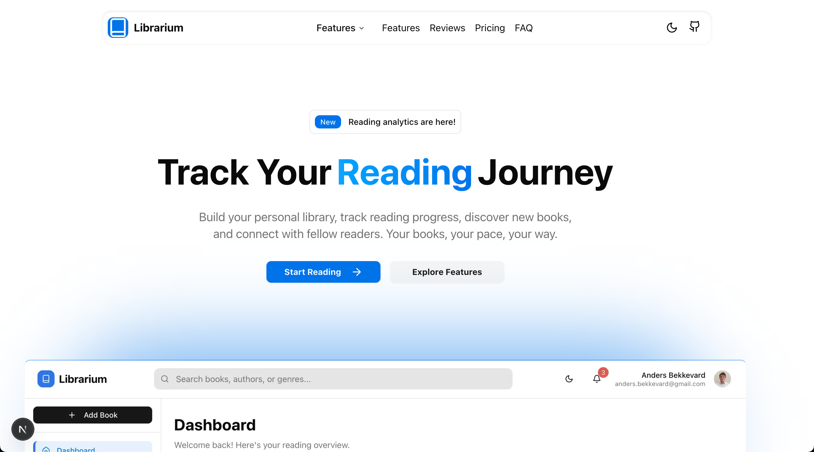
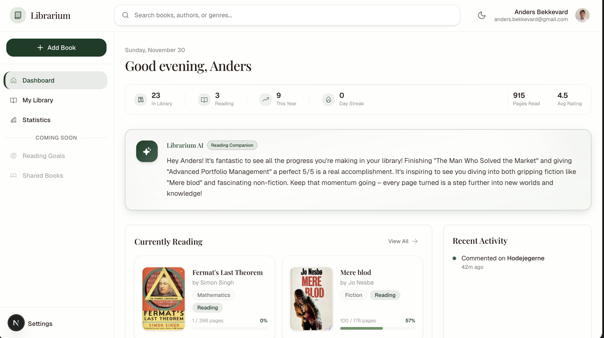

# Librarium

A modern, production-ready personal book collection management app with real-time synchronization and reading analytics.

### Landing page



### Dashboard



## Overview

Librarium is a personal book collection management app built with modern web technologies. It provides a seamless reading experience with real-time data synchronization, detailed analytics, and a clean, Notion-inspired interface. The application follows service layer architecture principles and production-ready error handling.

## Production-Ready Features

Librarium is fully production-ready with 15+ major features implemented:

### Core Functionality
- **Firebase Authentication**: Complete Google OAuth with automatic profile creation
- **Personal Library Management**: Full CRUD operations with real-time synchronization
- **Reading State Management**: Enforced state machine (not_started → in_progress → finished)
- **Progress Tracking**: Page-by-page reading progress with percentage calculations
- **Google Books API Integration**: Automated book metadata fetching and search
- **Book Rating System**: 1-5 star ratings with visual display
- **Advanced Search & Discovery**: Multi-criteria filtering and sorting capabilities

### Enhanced Features
- **Comment System**: Contextual comments with page numbers and reading state
- **Review System**: Comprehensive book reviews with timestamps
- **Event Logging & Activity Tracking**: Complete timeline of all reading activities
- **Statistics Dashboard**: Real-time reading insights with visual stat cards
- **Advanced Analytics**: Genre-based charts and 12-month activity visualization
- **AI Reading Motivation**: Each day, Librarium generates a personalized, encouraging message using Google Gemini AI. The message is tailored to your reading stats, recent activity, and book preferences, and is designed to motivate and celebrate your reading journey. If the AI is unavailable, a thoughtful fallback message is provided. All messages are stored securely and refreshed every 24 hours.
- **Mobile-First Design**: Fully responsive with touch-optimized interactions
- **Error Handling**: Comprehensive error boundaries and recovery actions

### Architecture
- **Service Layer Architecture**: Clean separation with repository pattern
- **Real-time Updates**: Firebase listeners for live data synchronization
- **Type Safety**: Comprehensive TypeScript with centralized models
- **Testing**: Jest test suite with 70% coverage threshold

## Technology Stack

### Frontend
- **Next.js 15** (App Router, React 19, TypeScript)
- **Tailwind CSS 4** + **shadcn/ui** (Radix UI primitives)
- **React 19** with functional components and hooks
- **TypeScript** with strict mode and comprehensive typing
- **Recharts** for advanced analytics and visualizations
- **Lucide React** for consistent iconography

### Backend & Database
- **Firebase Auth** (Google OAuth 2.0 with session management)
- **Firestore** (Real-time NoSQL database with user-centric security)
- **Google Books API** (Automatic metadata fetching and search)

### Development & Testing
- **Jest** + **React Testing Library** (70% coverage threshold)
- **ESLint** (next/core-web-vitals, next/typescript configurations)
- **Turbopack** (Fast development bundler for Next.js 15)
- **Firebase Emulator** (Local development and testing)

## Architecture

Librarium implements **strict service layer architecture** with enforced separation of concerns:

```
Components → Providers → Services → Repositories → External APIs
```

### Architectural Layers (STRICT RULES)
- **Components** (`/src/components`, `/src/app`) - Call ONLY Provider hooks
- **Providers** (`/src/lib/providers`) - Call ONLY Service methods  
- **Services** (`/src/lib/services`) - Call ONLY Repository methods + other Services
- **Repositories** (`/src/lib/repositories`) - Call ONLY external APIs (Firebase)

### Key Design Patterns
- **Firebase-Native Approach**: Real-time listeners with optimistic updates
- **Event-Driven Architecture**: All user actions logged as BookEvents
- **TypeScript-First Development**: Centralized models with validation functions
- **Provider Context Pattern**: Specialized contexts for auth, users, books, and events
- **Repository Pattern**: Data access abstraction with standardized error handling
- **AI Motivation System**: Personalized motivational messages are generated daily using Google Gemini AI, based on user reading data. The system follows the strict service layer architecture: UI components request messages from a Provider, which calls a Service that orchestrates AI prompt generation and message storage via the Repository layer and Firebase AI.