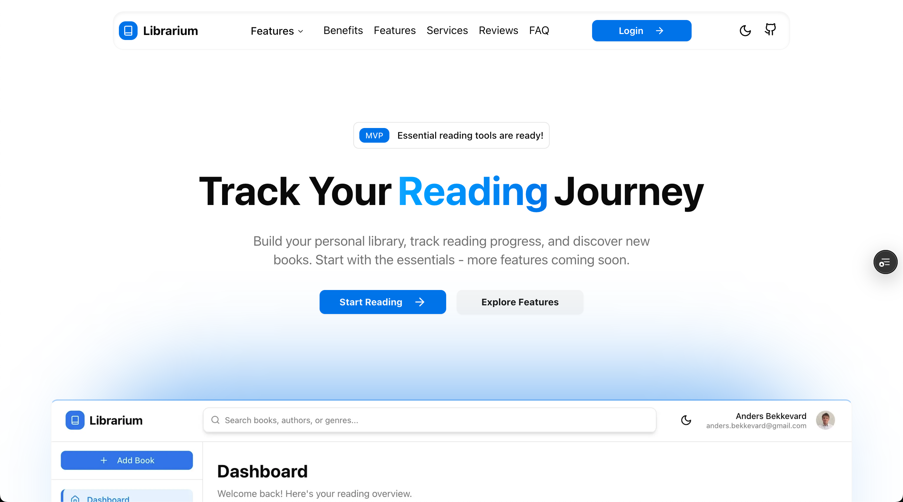

# Librarium

A web application for managing personal book collections and tracking reading progress.

### Landing page



### Dashboard


## Overview

Librarium is a personal library management system that allows users to organize their book collections, track reading progress, and maintain reading statistics. The application supports both owned books and wishlist items, with features for progress tracking and book rating.

## Current State

The application is in active development with the following functionality implemented:

- **User Authentication**: Google OAuth integration for user sign-in
- **Book Management**: Add, edit, delete, and organize books in personal library
- **Reading Progress**: Track reading state (not started, in progress, finished) with page-level progress tracking
- **Book Information**: Integration with Google Books API for automatic metadata retrieval
- **Library Organization**: Filter and sort books by various criteria (title, author, reading state, ownership)
- **Reading Statistics**: Detailed reading analytics with charts and goal tracking
- **Service Layer Architecture**: Clean separation of concerns with repository pattern
- **Event Logging**: Track reading activities and state changes
- **Responsive Design**: Mobile-friendly interface with modern UI components

## Technology Stack

### Frontend

- **Next.js 15**: React framework with App Router
- **React 19**: UI library with TypeScript support
- **TypeScript**: Type-safe development
- **Tailwind CSS**: Utility-first CSS framework
- **Radix UI**: Accessible component primitives (via shadcn/ui)
- **Lucide React**: Icon library

### Backend & Database

- **Firebase Authentication**: User management with Google OAuth
- **Firebase Firestore**: Real-time NoSQL database

- **Google Books API**: Book metadata and cover images

### Development Tools

- **ESLint**: Code linting with Next.js configuration
- **PostCSS**: CSS processing with Tailwind CSS
- **Turbopack**: Fast development bundler (Next.js 15)

## Architecture

The application follows a modern service layer architecture with:

- **Service Layer Pattern**: Business logic centralized in dedicated services
- **Repository Pattern**: Data access abstracted through repository interfaces  
- **Firebase-native Integration**: Real-time data synchronization via Firestore listeners
- **Type-safe Development**: TypeScript interfaces throughout the application
- **React Context Patterns**: Providers for state management and component composition
- **Clean Architecture**: Clear separation of concerns across layers

## Getting Started

1. Install dependencies:

```bash
npm install
```

2. Set up Firebase configuration:
   - Create a Firebase project
   - Enable Authentication with Google provider
   - Create a Firestore database
   - Add your Firebase configuration to environment variables

3. To run the development server:

```bash
npm run dev
```

4. Open [http://localhost:3000](http://localhost:3000) to view the application

## Planned Features

- **Shelf System**: Custom shelves and collections for book organization
- **Comments & Quotes**: Add notes, comments, and save favorite quotes
- **Household Sharing**: Share books with family members and track lending
- **LLM Integration**: AI-powered book recommendations and insights
- **Advanced Search**: Enhanced filtering and search capabilities
- **Import/Export**: Bulk import/export functionality

## Project Structure

```
src/
├── app/
│   ├── (app)/                # Authenticated app pages
│   ├── (landing)/            # Public landing page
│   ├── globals.css           # Global styles with custom color system
│   └── layout.tsx            # Root layout
├── components/
│   ├── app/                  # App-specific components (library, books, activity, book-detail, etc.)
│   ├── dashboard/            # Dashboard components
│   ├── landing/              # Landing page sections
│   ├── ui/                   # Reusable UI components (shadcn/ui)
│   └── icons/                # Icon components 
├── lib/
│   ├── api/                  # API integrations (e.g., Google Books, Firebase)
│   ├── books/                # Book utilities and validation
│   ├── constants/            # Centralized constants
│   ├── design/               # Color system and design tokens
│   ├── errors/               # Error handling utilities
│   ├── hooks/                # Custom React hooks
│   ├── models/               # TypeScript interfaces and models
│   ├── providers/            # Context providers
│   ├── repositories/         # Data access layer
│   ├── services/             # Business logic layer
│   ├── test-utils/           # Testing utilities and mocks
│   └── utils/                # General utility functions
└── __tests__/                # E2E and setup tests
```

## Development

- `npm run dev` - Start development server
- `npm run build` - Build for production
- `npm run start` - Start production server
- `npm run lint` - Run ESLint

## License

**Copyright (c) 2025 Librarium. All rights reserved.**

This software and associated documentation files (the "Software") are proprietary and confidential. The Software is owned by Librarium and is protected by copyright laws and international copyright treaties.

**No part of this Software may be reproduced, distributed, or transmitted in any form or by any means, including photocopying, recording, or other electronic or mechanical methods, without the prior written permission of Librarium, except in the case of brief quotations embodied in critical reviews and certain other noncommercial uses permitted by copyright law.**

**For permission requests, write to the copyright holder at the address below:**
anders.bekkevard@gmail.com
