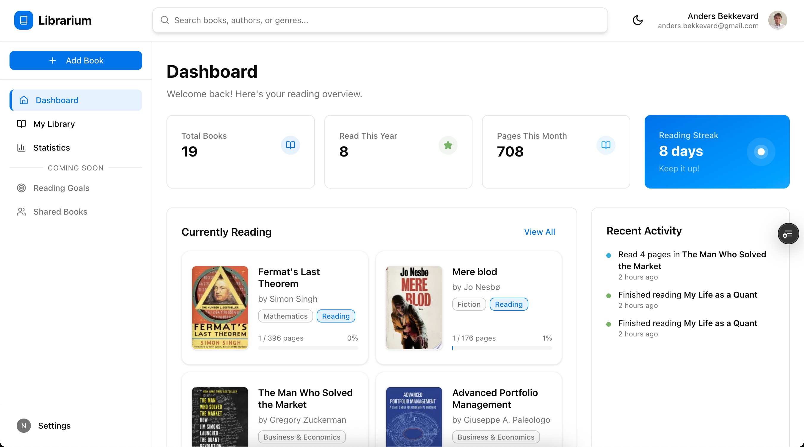

# Librarium

A modern, production-ready personal book collection management app with real-time synchronization and reading analytics.

### Landing page


### Dashboard



## Overview

Librarium is a personal book collection management app built with modern web technologies. It provides a seamless reading experience with real-time data synchronization, detailed analytics, and a clean, Notion-inspired interface. The application follows service layer architecture principles and production-ready error handling.

## Production-Ready Features

Librarium is fully production-ready with 15+ major features implemented:

### Core Functionality
- **Firebase Authentication**: Complete Google OAuth with automatic profile creation
- **Personal Library Management**: Full CRUD operations with real-time synchronization
- **Reading State Management**: Enforced state machine (not_started → in_progress → finished)
- **Progress Tracking**: Page-by-page reading progress with percentage calculations
- **Google Books API Integration**: Automated book metadata fetching and search
- **Book Rating System**: 1-5 star ratings with visual display
- **Advanced Search & Discovery**: Multi-criteria filtering and sorting capabilities

### Enhanced Features
- **Comment System**: Contextual comments with page numbers and reading state
- **Review System**: Comprehensive book reviews with timestamps
- **Event Logging & Activity Tracking**: Complete timeline of all reading activities
- **Statistics Dashboard**: Real-time reading insights with visual stat cards
- **Advanced Analytics**: Genre-based charts and 12-month activity visualization
- **Mobile-First Design**: Fully responsive with touch-optimized interactions
- **Error Handling**: Comprehensive error boundaries and recovery actions

### Architecture
- **Service Layer Architecture**: Clean separation with repository pattern
- **Real-time Updates**: Firebase listeners for live data synchronization
- **Type Safety**: Comprehensive TypeScript with centralized models
- **Testing**: Jest test suite with 70% coverage threshold

## Technology Stack

### Frontend
- **Next.js 15** (App Router, React 19, TypeScript)
- **Tailwind CSS 4** + **shadcn/ui** (Radix UI primitives)
- **React 19** with functional components and hooks
- **TypeScript** with strict mode and comprehensive typing
- **Recharts** for advanced analytics and visualizations
- **Lucide React** for consistent iconography

### Backend & Database
- **Firebase Auth** (Google OAuth 2.0 with session management)
- **Firestore** (Real-time NoSQL database with user-centric security)
- **Google Books API** (Automatic metadata fetching and search)

### Development & Testing
- **Jest** + **React Testing Library** (70% coverage threshold)
- **ESLint** (next/core-web-vitals, next/typescript configurations)
- **Turbopack** (Fast development bundler for Next.js 15)
- **Firebase Emulator** (Local development and testing)

## Architecture

Librarium implements **strict service layer architecture** with enforced separation of concerns:

```
Components → Providers → Services → Repositories → External APIs
```

### Architectural Layers (STRICT RULES)
- **Components** (`/src/components`, `/src/app`) - Call ONLY Provider hooks
- **Providers** (`/src/lib/providers`) - Call ONLY Service methods  
- **Services** (`/src/lib/services`) - Call ONLY Repository methods + other Services
- **Repositories** (`/src/lib/repositories`) - Call ONLY external APIs (Firebase)

### Key Design Patterns
- **Firebase-Native Approach**: Real-time listeners with optimistic updates
- **Event-Driven Architecture**: All user actions logged as BookEvents
- **TypeScript-First Development**: Centralized models with validation functions
- **Provider Context Pattern**: Specialized contexts for auth, users, books, and events
- **Repository Pattern**: Data access abstraction with standardized error handling

## Getting Started

1. Install dependencies:

```bash
npm install
```

2. Set up Firebase configuration:
   - Create a Firebase project
   - Enable Authentication with Google provider
   - Create a Firestore database
   - Add your Firebase configuration to environment variables

3. To run the development server:

```bash
npm run dev
```

4. Open [http://localhost:3000](http://localhost:3000) to view the application

## Partially Implemented & Planned Features

### Coming Soon
- **Wishlist Management**: Basic UI exists, functional operations in development
- **Reading Goals**: Goal progress display implemented, goal creation/management planned
- **Social Features**: Shared books page UI ready, backend functionality planned

### Planned
- **Organization & Shelf Features**: Custom shelves and themed collections
- **Quote Collection**: Save memorable passages with page references
- **Reading Journal**: Detailed notes and reading journey tracking
- **Real-time Collaboration**: Book sharing with family/household members
- **LLM Integration**: AI reading coach and personalized recommendations
- **Advanced Goal System**: Achievement system and reading challenges

## Project Structure

```
src/
├── app/
│   ├── (app)/                # Authenticated app pages
│   ├── (landing)/            # Public landing page
│   ├── globals.css           # Global styles with custom color system
│   └── layout.tsx            # Root layout
├── components/
│   ├── app/                  # App-specific components (library, books, activity, book-detail, etc.)
│   ├── dashboard/            # Dashboard components
│   ├── landing/              # Landing page sections
│   ├── ui/                   # Reusable UI components (shadcn/ui)
│   └── icons/                # Icon components 
├── lib/
│   ├── api/                  # API integrations (e.g., Google Books, Firebase)
│   ├── books/                # Book utilities and validation
│   ├── constants/            # Centralized constants
│   ├── design/               # Color system and design tokens
│   ├── errors/               # Error handling utilities
│   ├── hooks/                # Custom React hooks
│   ├── models/               # TypeScript interfaces and models
│   ├── providers/            # Context providers
│   ├── repositories/         # Data access layer
│   ├── services/             # Business logic layer
│   ├── test-utils/           # Testing utilities and mocks
│   └── utils/                # General utility functions
└── __tests__/                # E2E and setup tests
```

## Development Commands

### Development
```bash
npm run dev           # Start development server with Turbopack
npm run build         # Build for production
```

### Code Quality
```bash
npm run lint          # Run ESLint (next/core-web-vitals, next/typescript)
```

### Testing
```bash
npm run test          # Run Jest test suite
npm run test:watch    # Run tests in watch mode  
npm run test:coverage # Run tests with coverage report
```

## License

**Copyright (c) 2025 Librarium. All rights reserved.**

This software and associated documentation files (the "Software") are proprietary and confidential. The Software is owned by Librarium and is protected by copyright laws and international copyright treaties.

**No part of this Software may be reproduced, distributed, or transmitted in any form or by any means, including photocopying, recording, or other electronic or mechanical methods, without the prior written permission of Librarium, except in the case of brief quotations embodied in critical reviews and certain other noncommercial uses permitted by copyright law.**

**For permission requests, write to the copyright holder at the address below:**
anders.bekkevard@gmail.com
