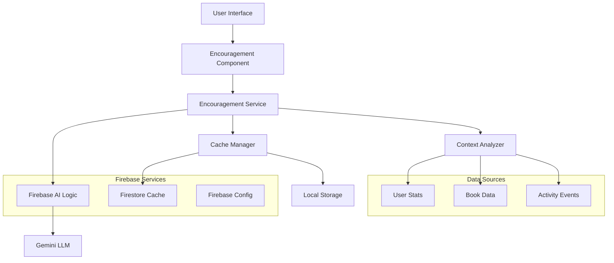

# Design Document

## Overview

The LLM Encouragement System integrates Firebase AI Logic with Gemini LLM to provide personalized, contextual encouragement messages across key pages of the reading tracker application. The system will generate motivational content based on user reading data, cache messages for performance, and provide a consistent visual experience that enhances user engagement without disrupting the existing UI.

## Architecture

### High-Level Architecture



### Component Architecture

The system follows a layered architecture:

1. **Presentation Layer**: React components for displaying encouragement messages
2. **Service Layer**: Business logic for message generation and caching
3. **Data Layer**: Firebase AI Logic integration and cache management
4. **Context Layer**: Data analysis and prompt generation

## Components and Interfaces

### Core Components

#### 1. EncouragementMessage Component

```typescript
interface EncouragementMessageProps {
  pageContext: 'dashboard' | 'library' | 'statistics';
  className?: string;
  fallbackMessage?: string;
}

interface EncouragementMessageState {
  message: string | null;
  loading: boolean;
  error: boolean;
  lastUpdated: Date | null;
}
```

**Responsibilities:**
- Display encouragement messages with consistent styling
- Handle loading and error states
- Integrate with the encouragement service
- Provide fallback content when AI service fails

#### 2. EncouragementService

```typescript
interface IEncouragementService {
  generateMessage(context: PageContext): Promise<ServiceResult<string>>;
  getCachedMessage(pageContext: string, userId: string): Promise<string | null>;
  setCachedMessage(pageContext: string, userId: string, message: string): Promise<void>;
  shouldRefreshMessage(pageContext: string, userId: string): Promise<boolean>;
  clearCache(userId: string): Promise<void>;
}

interface PageContext {
  page: 'dashboard' | 'library' | 'statistics';
  userId: string;
  userStats: UserStats;
  books: Book[];
  recentActivity: BookEvent[];
}
```

**Responsibilities:**
- Generate personalized messages using Firebase AI Logic
- Manage message caching and refresh logic
- Analyze user context for relevant prompts
- Handle service failures gracefully

#### 3. Firebase AI Logic Integration

```typescript
interface AILogicConfig {
  model: 'gemini-1.5-flash' | 'gemini-1.5-pro';
  maxTokens: number;
  temperature: number;
  systemPrompt: string;
}

interface MessageGenerationRequest {
  context: PageContext;
  config: AILogicConfig;
}
```

**Responsibilities:**
- Initialize Firebase AI Logic SDK
- Configure Gemini model parameters
- Send prompts and receive responses
- Handle API rate limits and errors

#### 4. React-Based Caching Strategy

```typescript
interface EncouragementHookState {
  message: string | null;
  loading: boolean;
  error: boolean;
  lastGenerated: Date | null;
}

interface CacheConfig {
  maxAge: number; // 24 hours in milliseconds
  refreshTriggers: RefreshTrigger[];
}

type RefreshTrigger = 'login' | 'logout' | 'daily' | 'dataChange';
```

**React Caching Approach:**
- Use `useMemo` to cache messages based on user data dependencies
- Use `useEffect` to handle refresh triggers (login/logout, daily refresh)
- Use `localStorage` for persistence across sessions
- Leverage React's built-in dependency tracking for automatic invalidation

### Data Models

#### Extended User Context

```typescript
interface UserEncouragementContext extends UserStats {
  readingTrend: 'improving' | 'stable' | 'declining';
  recentAchievements: string[];
  strugglingAreas: string[];
  personalityProfile: 'motivated' | 'casual' | 'goal-oriented';
}
```

#### Message Templates

```typescript
interface MessageTemplate {
  id: string;
  pageContext: string;
  condition: string; // e.g., "reading_on_track", "behind_goal"
  template: string;
  tone: 'encouraging' | 'congratulatory' | 'motivational';
}
```

## Error Handling

### Error Types

1. **AI Service Errors**
   - Network connectivity issues
   - API rate limit exceeded
   - Invalid API responses
   - Service unavailable

2. **Cache Errors**
   - Storage quota exceeded
   - Cache corruption
   - Permission errors

3. **Data Errors**
   - Missing user context
   - Invalid user data
   - Stale data issues

### Error Handling Strategy

```typescript
interface ErrorHandlingStrategy {
  fallbackMessages: Record<string, string[]>;
  retryPolicy: {
    maxRetries: number;
    backoffStrategy: 'exponential' | 'linear';
    retryDelay: number;
  };
  gracefulDegradation: boolean;
}
```

**Implementation:**
- Use cached messages when AI service fails
- Display predefined fallback messages if no cache exists
- Log errors for monitoring and debugging
- Retry failed requests with exponential backoff
- Never block UI rendering due to encouragement failures

## Testing Strategy

### Unit Testing

1. **Component Testing**
   - Message display and formatting
   - Loading and error state handling
   - Props validation and edge cases

2. **Service Testing**
   - Message generation logic
   - Cache management operations
   - Error handling scenarios
   - Mock Firebase AI Logic responses

3. **Integration Testing**
   - End-to-end message flow
   - Cache refresh triggers
   - Cross-page consistency
   - Performance under load

### Test Data Strategy

```typescript
interface TestScenarios {
  userProfiles: {
    activeReader: UserStats;
    casualReader: UserStats;
    newUser: UserStats;
    strugglingReader: UserStats;
  };
  
  mockResponses: {
    successfulGeneration: string[];
    apiErrors: Error[];
    networkFailures: Error[];
  };
  
  cacheStates: {
    empty: CacheEntry[];
    stale: CacheEntry[];
    fresh: CacheEntry[];
    corrupted: CacheEntry[];
  };
}
```

## Implementation Details

### Firebase AI Logic Setup

1. **Project Configuration**
   - Enable Firebase AI Logic in Firebase Console
   - Configure Gemini API provider (Developer API for free tier)
   - Set up App Check for production security

2. **SDK Integration**
   ```typescript
   import { getGenerativeModel } from 'firebase/ai-logic';
   
   const model = getGenerativeModel(app, {
     model: 'gemini-1.5-flash',
     generationConfig: {
       temperature: 0.7,
       maxOutputTokens: 150,
     },
   });
   ```

3. **Security Configuration**
   - Implement Firebase App Check
   - Configure per-user rate limits
   - Set up API key protection

### Message Generation Strategy

#### Context Analysis

```typescript
function analyzeUserContext(context: PageContext): PromptContext {
  const { userStats, books, recentActivity } = context;
  
  return {
    readingLevel: calculateReadingLevel(userStats),
    recentProgress: analyzeRecentProgress(recentActivity),
    achievements: identifyAchievements(userStats, books),
    challenges: identifyStruggles(userStats, recentActivity),
    preferences: inferPreferences(books),
  };
}
```

#### Prompt Engineering

**System Prompt Template:**
```
You are a supportive reading companion AI. Generate brief, encouraging messages (2-3 sentences max) for readers based on their activity. Be warm, personal, and motivating without being overly enthusiastic. Focus on specific achievements and gentle encouragement for challenges.

Context: {pageContext}
User Stats: {userStats}
Recent Activity: {recentActivity}
Tone: {tone}
```

**Page-Specific Prompts:**
- **Dashboard**: Focus on current reading status and daily motivation
- **Library**: Emphasize collection growth and reading variety
- **Statistics**: Celebrate achievements and progress trends

### React-Based Caching Implementation

#### Custom Hook with useMemo
```typescript
function useEncouragementMessage(pageContext: string, userContext: PageContext) {
  const [lastLoginTime, setLastLoginTime] = useState<Date | null>(null);
  const [dailyRefreshKey, setDailyRefreshKey] = useState(getCurrentDateString());
  
  // Cache message based on user data dependencies
  const cachedMessage = useMemo(() => {
    const cacheKey = `encouragement:${userContext.userId}:${pageContext}:${dailyRefreshKey}`;
    return localStorage.getItem(cacheKey);
  }, [userContext.userId, pageContext, dailyRefreshKey, userContext.userStats, userContext.books.length]);
  
  // Generate new message when cache is invalid
  const generateMessage = useCallback(async () => {
    if (cachedMessage && !shouldRefreshMessage(cachedMessage, userContext)) {
      return cachedMessage;
    }
    
    const newMessage = await encouragementService.generateMessage(userContext);
    const cacheKey = `encouragement:${userContext.userId}:${pageContext}:${dailyRefreshKey}`;
    localStorage.setItem(cacheKey, newMessage);
    return newMessage;
  }, [cachedMessage, userContext, pageContext, dailyRefreshKey]);
  
  // Handle daily refresh
  useEffect(() => {
    const checkDailyRefresh = () => {
      const currentDate = getCurrentDateString();
      if (currentDate !== dailyRefreshKey) {
        setDailyRefreshKey(currentDate);
      }
    };
    
    const interval = setInterval(checkDailyRefresh, 60000); // Check every minute
    return () => clearInterval(interval);
  }, [dailyRefreshKey]);
  
  return { generateMessage, cachedMessage };
}
```

#### Dependency-Based Invalidation
```typescript
// React automatically invalidates useMemo when dependencies change:
// - User stats changes (reading progress, books finished)
// - Book collection changes (new books added)
// - Daily refresh (date changes)
// - User login/logout (userId changes)
```

### Visual Design Integration

#### Component Styling
```typescript
const encouragementStyles = {
  container: "bg-gradient-to-r from-brand-primary/5 to-brand-accent/5 border border-brand-primary/20 rounded-lg p-4 mb-6",
  icon: "h-5 w-5 text-brand-primary",
  message: "text-sm text-foreground/90 leading-relaxed",
  loading: "animate-pulse bg-muted rounded h-4 w-3/4",
  error: "text-muted-foreground text-xs"
};
```

#### Icon Selection
- Use `Sparkles` icon from Lucide React to represent AI assistance
- Consistent placement and sizing across all pages
- Subtle animation on message updates

### Performance Considerations

1. **Lazy Loading**: Load encouragement service only when needed
2. **Request Debouncing**: Prevent multiple simultaneous API calls
3. **Background Refresh**: Update cache in background without blocking UI
4. **Memory Management**: Clean up old cache entries regularly

### Configuration Management

```typescript
interface EncouragementConfig {
  enabled: boolean;
  refreshTriggers: RefreshTrigger[];
  cacheStrategy: 'aggressive' | 'conservative';
  fallbackEnabled: boolean;
  debugMode: boolean;
}
```

**Configuration Sources:**
- Environment variables for API keys and endpoints
- Firebase Remote Config for feature flags and parameters
- Local configuration for development overrides

This design provides a robust, scalable foundation for the LLM encouragement system while maintaining consistency with the existing application architecture and design patterns.