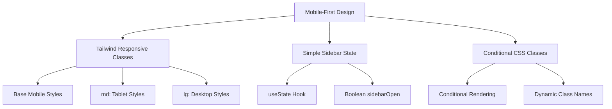
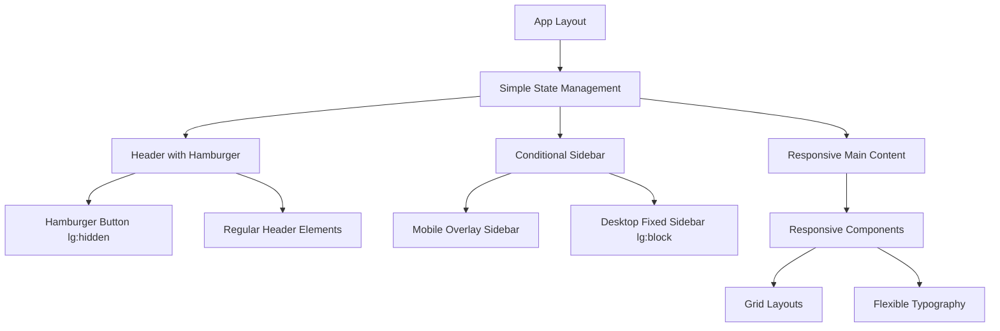

# Design Document

## Overview

This design outlines a simple, effective responsive transformation using Tailwind CSS's built-in responsive utilities and minimal JavaScript state management. The approach leverages Tailwind's mobile-first methodology and proven patterns to create a fully responsive experience while maintaining zero changes to the desktop layout.

The solution focuses on simplicity and maintainability, using Tailwind's responsive prefixes (`sm:`, `md:`, `lg:`) and a single boolean state for sidebar management, avoiding complex provider systems or custom breakpoint detection.

## Architecture

### Simple Responsive Architecture



### Component Structure



## Implementation Strategy

### 1. Tailwind-First Responsive Design

Use Tailwind's built-in responsive system as the primary responsive mechanism:

```typescript
// Example responsive grid pattern
const gridClasses = `
  grid grid-cols-1           // Mobile: 1 column
  md:grid-cols-2            // Tablet: 2 columns  
  lg:grid-cols-3            // Desktop: 3 columns
  gap-4 md:gap-6            // Responsive spacing
`

// Example responsive card pattern  
const cardClasses = `
  w-full h-32 flex-row      // Mobile: horizontal card
  md:h-40                   // Tablet: taller card
  lg:w-64 lg:h-80 lg:flex-col  // Desktop: vertical card
`
```

### 2. Simple Sidebar State Management

Replace complex provider systems with simple component state:

```typescript
// Simple state management - no providers needed
const [sidebarOpen, setSidebarOpen] = useState(false)

// Toggle function
const toggleSidebar = () => setSidebarOpen(!sidebarOpen)

// Close on backdrop click
const closeSidebar = () => setSidebarOpen(false)
```

### 3. Conditional Sidebar Implementation

Use conditional rendering and Tailwind classes for sidebar behavior:

```typescript
// Hamburger button - only visible on mobile/tablet
<button 
  onClick={toggleSidebar}
  className="lg:hidden p-2 rounded-md hover:bg-gray-100"
>
  <Menu className="h-6 w-6" />
</button>

// Mobile sidebar overlay
{sidebarOpen && (
  <>
    {/* Backdrop */}
    <div 
      className="fixed inset-0 bg-black/50 z-40 lg:hidden"
      onClick={closeSidebar} 
    />
    
    {/* Sidebar */}
    <aside className={`
      fixed left-0 top-0 h-full w-64 bg-background border-r z-50
      transform transition-transform duration-300 ease-in-out
      ${sidebarOpen ? 'translate-x-0' : '-translate-x-full'}
      lg:hidden
    `}>
      <SidebarContent />
    </aside>
  </>
)}

// Desktop sidebar - always visible
<aside className="hidden lg:block fixed left-0 top-[72px] w-64 h-[calc(100vh-72px)] bg-background border-r z-40">
  <SidebarContent />
</aside>
```

## Component Implementation Patterns

### 1. Responsive Grid Layouts

Use Tailwind's responsive grid system for adaptable layouts:

```typescript
// Library grid that adapts across devices
<div className={`
  grid gap-4 p-4
  grid-cols-1                    // Mobile: single column
  md:grid-cols-2                 // Tablet: 2 columns
  lg:grid-cols-3                 // Desktop: 3 columns
  xl:grid-cols-4                 // Large desktop: 4 columns
`}>
  {books.map(book => <BookCard key={book.id} book={book} />)}
</div>
```

### 2. Responsive Typography

Use Tailwind's text size utilities for scalable typography:

```typescript
// Hero section with responsive text
<h1 className={`
  text-3xl font-bold leading-tight     // Mobile: 30px
  md:text-4xl                          // Tablet: 36px  
  lg:text-5xl                          // Desktop: 48px
  xl:text-6xl                          // Large: 60px
`}>
  Track Your Reading Journey
</h1>
```

### 3. Responsive Book Cards

Transform book cards using conditional layouts:

```typescript
const BookCard = ({ book }) => (
  <Card className={`
    w-full overflow-hidden
    h-32 md:h-40                      // Responsive height
    lg:h-80 lg:w-64                   // Desktop dimensions
  `}>
    <CardContent className={`
      p-3 h-full
      flex gap-3 flex-row             // Mobile: horizontal
      lg:flex-col lg:gap-4            // Desktop: vertical
    `}>
      <div className={`
        flex-shrink-0
        w-20 h-full                   // Mobile: small square
        lg:w-full lg:h-48             // Desktop: large rectangle
      `}>
        <BookCover book={book} />
      </div>
      
      <div className={`
        flex-1 flex flex-col justify-between min-w-0
        lg:flex-none                  // Desktop: natural sizing
      `}>
        <BookInfo book={book} />
        <BookProgress book={book} />
      </div>
    </CardContent>
  </Card>
)
```

## Layout Breakpoints

### Tailwind Default Breakpoints (Used As-Is)

| Breakpoint | Min Width | Usage |
|------------|-----------|--------|
| `sm:` | 640px | Large mobile |
| `md:` | 768px | Tablet |
| `lg:` | 1024px | Desktop |
| `xl:` | 1280px | Large desktop |

### Layout Behavior

- **Mobile (< 768px)**: Single column, stacked layout, hidden sidebar
- **Tablet (768px - 1023px)**: 2-column grids, overlay sidebar  
- **Desktop (≥ 1024px)**: Multi-column grids, fixed sidebar, existing layout preserved

## Error Handling & Performance

### Progressive Enhancement

- Base mobile styles work without JavaScript
- Sidebar toggle enhances with JavaScript
- No JavaScript dependencies for core responsive behavior

### Performance Optimizations

- No complex state management overhead
- CSS-driven responsive behavior
- Minimal JavaScript for sidebar toggle only
- Leverages Tailwind's optimized CSS output

## Testing Strategy

### Responsive Testing Approach

1. **Visual Testing**: Test at Tailwind's standard breakpoints
2. **Functionality Testing**: Verify sidebar toggle and content accessibility
3. **Performance Testing**: Ensure no desktop performance impact
4. **Touch Testing**: Validate touch targets on mobile devices

### Implementation Validation

- Desktop experience remains pixel-perfect
- Mobile layouts stack properly without horizontal scroll
- Sidebar state management works reliably
- Touch targets meet 44px minimum requirements

## Migration Strategy

### Incremental Implementation

1. **Add Hamburger Menu**: Simple button with toggle state
2. **Implement Mobile Sidebar**: Conditional overlay with backdrop
3. **Update Component Classes**: Add responsive Tailwind classes to existing components
4. **Test and Refine**: Validate across devices and fix edge cases

### Zero-Risk Desktop Preservation

- All responsive classes use `lg:` prefix or below
- Desktop layout (`lg:` and above) remains unchanged
- Existing `ml-64` pattern preserved for desktop
- No breaking changes to current desktop experience

This approach delivers a fully responsive experience using proven patterns, minimal complexity, and maximum maintainability while preserving the existing desktop experience exactly as it is.