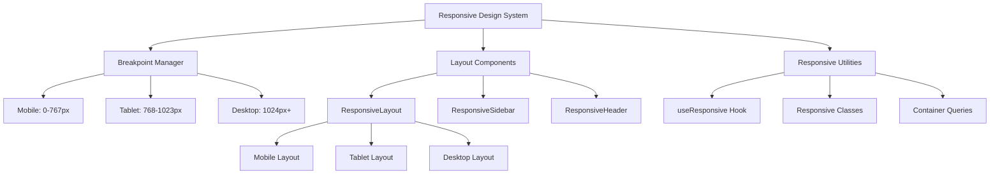
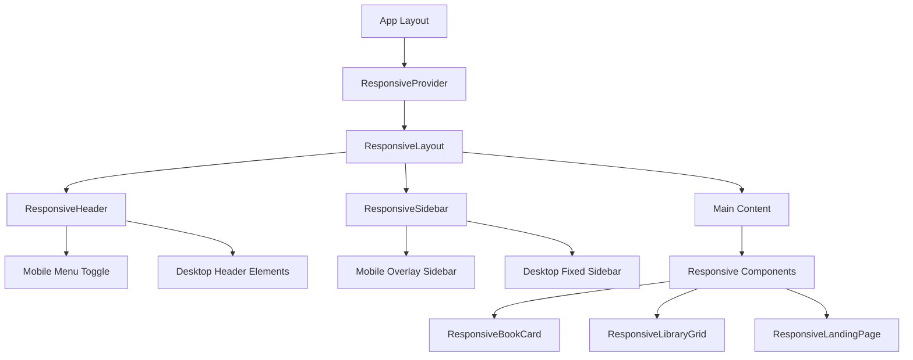

# Design Document

## Overview

This design outlines a comprehensive responsive UI refactor that transforms the existing desktop-focused application into a fully responsive, mobile-first experience while maintaining 100% functional equivalence on desktop. The solution leverages modern React and Next.js patterns with a centralized responsive design system, ensuring consistent behavior across all device types.

The current application uses Tailwind CSS with custom CSS variables and has a fixed sidebar layout optimized for desktop. The refactor will introduce a responsive breakpoint system, mobile-optimized components, and a toggleable sidebar while preserving the existing desktop experience exactly as it is.

## Architecture

### Responsive Design System Architecture



### Component Hierarchy



## Components and Interfaces

### 1. Responsive Provider System

#### ResponsiveProvider
```typescript
interface ResponsiveContextType {
  breakpoint: 'mobile' | 'tablet' | 'desktop';
  isMobile: boolean;
  isTablet: boolean;
  isDesktop: boolean;
  sidebarOpen: boolean;
  setSidebarOpen: (open: boolean) => void;
  toggleSidebar: () => void;
}

interface ResponsiveProviderProps {
  children: React.ReactNode;
}
```

#### useResponsive Hook
```typescript
interface UseResponsiveReturn {
  breakpoint: 'mobile' | 'tablet' | 'desktop';
  isMobile: boolean;
  isTablet: boolean;
  isDesktop: boolean;
  sidebarOpen: boolean;
  setSidebarOpen: (open: boolean) => void;
  toggleSidebar: () => void;
}
```

### 2. Layout Components

#### ResponsiveLayout
```typescript
interface ResponsiveLayoutProps {
  children: React.ReactNode;
}
```

#### ResponsiveHeader
```typescript
interface ResponsiveHeaderProps {
  notificationCount?: number;
}
```

#### ResponsiveSidebar
```typescript
interface ResponsiveSidebarProps {
  onAddBookClick?: () => void;
  customColors?: {
    active: string;
    hover: string;
    text: string;
    border: string;
  };
}
```

### 3. Responsive Component Variants

#### ResponsiveBookCard
```typescript
interface ResponsiveBookCardProps {
  book: Book;
  onBookClick?: (bookId: string) => void;
  variant?: 'mobile' | 'tablet' | 'desktop';
}
```

#### ResponsiveLibraryGrid
```typescript
interface ResponsiveLibraryGridProps {
  books: Book[];
  viewMode: ViewMode;
  onBookClick?: (bookId: string) => void;
  loading?: boolean;
  error?: string | null;
  onRefresh?: () => void;
  onClearFilters?: () => void;
  activeFiltersCount?: number;
}
```

### 4. Breakpoint Configuration

```typescript
interface BreakpointConfig {
  mobile: {
    min: number;
    max: number;
  };
  tablet: {
    min: number;
    max: number;
  };
  desktop: {
    min: number;
  };
}

const BREAKPOINTS: BreakpointConfig = {
  mobile: { min: 0, max: 767 },
  tablet: { min: 768, max: 1023 },
  desktop: { min: 1024 }
};
```

## Data Models

### Responsive State Management

```typescript
interface ResponsiveState {
  currentBreakpoint: 'mobile' | 'tablet' | 'desktop';
  sidebarOpen: boolean;
  windowWidth: number;
  windowHeight: number;
}

interface ResponsiveActions {
  setBreakpoint: (breakpoint: 'mobile' | 'tablet' | 'desktop') => void;
  setSidebarOpen: (open: boolean) => void;
  toggleSidebar: () => void;
  updateWindowSize: (width: number, height: number) => void;
}
```

### Component Responsive Configurations

```typescript
interface ComponentResponsiveConfig {
  mobile: {
    className: string;
    props?: Record<string, any>;
  };
  tablet: {
    className: string;
    props?: Record<string, any>;
  };
  desktop: {
    className: string;
    props?: Record<string, any>;
  };
}

// Example for BookCard
const BOOK_CARD_CONFIG: ComponentResponsiveConfig = {
  mobile: {
    className: "w-full h-32 flex-row",
    props: { compact: true }
  },
  tablet: {
    className: "w-full h-40 flex-col",
    props: { compact: false }
  },
  desktop: {
    className: "w-64 h-80 flex-col",
    props: { compact: false }
  }
};
```

## Error Handling

### Responsive Error Boundaries

```typescript
interface ResponsiveErrorBoundaryProps {
  children: React.ReactNode;
  fallback?: {
    mobile: React.ComponentType;
    tablet: React.ComponentType;
    desktop: React.ComponentType;
  };
}
```

### Breakpoint Detection Errors

```typescript
interface BreakpointError {
  type: 'BREAKPOINT_DETECTION_FAILED' | 'WINDOW_RESIZE_ERROR';
  message: string;
  fallbackBreakpoint: 'mobile' | 'tablet' | 'desktop';
}
```

### Layout Shift Prevention

```typescript
interface LayoutStabilityConfig {
  preventLayoutShift: boolean;
  reserveSpace: boolean;
  transitionDuration: number;
  fallbackDimensions: {
    width: number;
    height: number;
  };
}
```

## Testing Strategy

### 1. Responsive Testing Framework

#### Breakpoint Testing
- Test component rendering at each breakpoint
- Verify responsive behavior during window resize
- Validate touch interactions on mobile/tablet
- Ensure keyboard navigation works across devices

#### Visual Regression Testing
- Screenshot comparison across breakpoints
- Layout consistency verification
- Component spacing and alignment tests
- Typography scaling validation

### 2. Functional Testing

#### Desktop Equivalence Testing
```typescript
describe('Desktop Functional Equivalence', () => {
  test('All desktop functionality remains identical', () => {
    // Test that desktop behavior is unchanged
  });
  
  test('No visual changes on desktop viewport', () => {
    // Verify pixel-perfect desktop experience
  });
});
```

#### Mobile Functionality Testing
```typescript
describe('Mobile Functionality', () => {
  test('Sidebar toggles correctly on mobile', () => {
    // Test mobile sidebar behavior
  });
  
  test('Touch interactions work properly', () => {
    // Test touch events and gestures
  });
  
  test('No horizontal scrolling occurs', () => {
    // Verify mobile layout constraints
  });
});
```


### 4. Accessibility Testing

#### Responsive Accessibility
- Screen reader compatibility across devices
- Touch target size validation (minimum 44px)
- Keyboard navigation on all breakpoints
- Focus management during sidebar transitions

## Implementation Details

### 1. Breakpoint System Implementation

The responsive system will use CSS custom properties combined with JavaScript for dynamic behavior:

```css
:root {
  --breakpoint-mobile: 767px;
  --breakpoint-tablet: 1023px;
  --sidebar-width: 256px;
  --header-height: 72px;
}

@media (max-width: 767px) {
  .responsive-layout {
    --sidebar-position: fixed;
    --sidebar-transform: translateX(-100%);
    --main-margin-left: 0;
  }
}

@media (min-width: 768px) and (max-width: 1023px) {
  .responsive-layout {
    --sidebar-position: fixed;
    --sidebar-transform: translateX(-100%);
    --main-margin-left: 0;
  }
}

@media (min-width: 1024px) {
  .responsive-layout {
    --sidebar-position: fixed;
    --sidebar-transform: translateX(0);
    --main-margin-left: var(--sidebar-width);
  }
}
```

### 2. Mobile Sidebar Implementation

The mobile sidebar will use a slide-in overlay pattern:

```typescript
const MobileSidebar = () => {
  const { sidebarOpen, setSidebarOpen } = useResponsive();
  
  return (
    <>
      {/* Backdrop */}
      {sidebarOpen && (
        <div 
          className="fixed inset-0 bg-black/50 z-40 lg:hidden"
          onClick={() => setSidebarOpen(false)}
        />
      )}
      
      {/* Sidebar */}
      <div className={`
        fixed left-0 top-0 h-full w-64 bg-background border-r border-border z-50
        transform transition-transform duration-300 ease-in-out lg:hidden
        ${sidebarOpen ? 'translate-x-0' : '-translate-x-full'}
      `}>
        {/* Sidebar content */}
      </div>
    </>
  );
};
```

### 3. Responsive Component Pattern

Components will use a consistent pattern for responsive behavior:

```typescript
const ResponsiveComponent = ({ ...props }) => {
  const { breakpoint, isMobile, isTablet, isDesktop } = useResponsive();
  
  const getResponsiveClasses = () => {
    if (isMobile) return 'mobile-specific-classes';
    if (isTablet) return 'tablet-specific-classes';
    return 'desktop-specific-classes';
  };
  
  const getResponsiveProps = () => {
    if (isMobile) return { compact: true, orientation: 'horizontal' };
    if (isTablet) return { compact: false, orientation: 'vertical' };
    return { compact: false, orientation: 'vertical' };
  };
  
  return (
    <div className={getResponsiveClasses()}>
      <ComponentContent {...props} {...getResponsiveProps()} />
    </div>
  );
};
```

### 4. Landing Page Responsive Design

The landing page will use modern responsive techniques:

```typescript
const ResponsiveLandingPage = () => {
  return (
    <div className="responsive-landing">
      {/* Hero Section */}
      <section className="
        px-4 py-12 
        sm:px-6 sm:py-16 
        lg:px-8 lg:py-24
        container mx-auto
      ">
        <div className="
          text-center space-y-6
          sm:space-y-8
          lg:space-y-12
        ">
          <h1 className="
            text-3xl font-bold
            sm:text-4xl
            lg:text-6xl
            leading-tight
          ">
            Track Your Reading Journey
          </h1>
          
          <p className="
            text-lg text-muted-foreground max-w-2xl mx-auto
            sm:text-xl
            lg:text-2xl
          ">
            Build your personal library, track reading progress, and discover new books.
          </p>
          
          <div className="
            flex flex-col gap-4
            sm:flex-row sm:justify-center sm:gap-6
          ">
            <Button size="lg" className="w-full sm:w-auto">
              Start Reading
            </Button>
            <Button variant="outline" size="lg" className="w-full sm:w-auto">
              Explore Features
            </Button>
          </div>
        </div>
      </section>
    </div>
  );
};
```

### 5. Book Card Mobile Optimization

The BookCard will adapt its layout for mobile:

```typescript
const ResponsiveBookCard = ({ book, ...props }) => {
  const { isMobile } = useResponsive();
  
  if (isMobile) {
    return (
      <Card className="w-full h-32 overflow-hidden">
        <CardContent className="p-3 h-full flex gap-3">
          {/* Horizontal layout for mobile */}
          <div className="flex-shrink-0 w-20 h-full">
            <BookCover book={book} />
          </div>
          <div className="flex-1 flex flex-col justify-between min-w-0">
            <BookInfo book={book} compact />
            <BookProgress book={book} compact />
          </div>
        </CardContent>
      </Card>
    );
  }
  
  // Return desktop version unchanged
  return <DesktopBookCard book={book} {...props} />;
};
```

This design ensures a seamless responsive experience while maintaining the existing desktop functionality exactly as it is, following modern React and Next.js best practices for 2025.